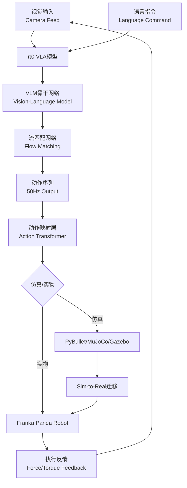

# π0 VLA Sim2Real - Franka Panda 具身智能集成项目

<div align="center">

**基于π0视觉-语言-动作模型的Franka Panda机器人仿真与实物迁移完整解决方案**

[English](#english) | [中文](#chinese)

[](LICENSE)
[](https://www.python.org/)
[](https://pybullet.org/)

</div>

---

<a name="chinese"></a>

## 📋 项目简介

本项目致力于将Physical Intelligence公司的**π0 VLA（Vision-Language-Action）模型**与**Franka Panda七自由度机械臂**深度集成，提供从仿真训练到真实环境部署的完整技术方案。项目涵盖多种主流仿真平台配置、Sim-to-Real迁移技术、以及具身AI控制器的实现细节。

### 🎯 核心目标

- **多模态控制**：融合视觉感知、语言理解和机器人动作执行
- **高频实时控制**：实现50Hz连续轨迹生成与执行
- **跨域迁移**：从仿真环境无缝迁移到真实机器人
- **开放研究平台**：提供完整的技术文档和实现指南

---

## ✨ 主要特性

### 🤖 π0 VLA模型集成
- ✅ 流匹配网络（Flow Matching）实现连续动作生成
- ✅ 视觉语言模型（VLM）+ 动作专家双模块架构
- ✅ 支持自然语言指令的灵巧操作任务
- ✅ 50Hz高频控制输出

### 🦾 Franka Panda机器人支持
- ✅ 7自由度全空间运动覆盖
- ✅ ±0.1mm重复定位精度
- ✅ 力反馈控制（扭矩传感器集成）
- ✅ 3kg最大负载能力

### 🌐 多仿真环境配置
| 仿真平台 | 应用场景 | 支持功能 |
|---------|---------|---------|
| **PyBullet** | 快速原型开发、强化学习训练 | 物理仿真、碰撞检测、逆运动学 |
| **MuJoCo** | 高精度动力学仿真 | 接触力建模、实时渲染 |
| **Gazebo** | ROS集成、多机器人协同 | 传感器仿真、分布式系统 |

### 🔄 Sim-to-Real迁移技术
- **域随机化**：视觉/动力学参数随机化
- **域适应**：对抗性特征对齐
- **神经增强模拟（NAS）**：弥补仿真与现实差距
- **知识蒸馏**：模型压缩与部署优化

---

## 📚 技术架构



### 核心技术栈
- **深度学习框架**：PyTorch、TensorFlow
- **机器人控制**：ROS、libfranka、Franka Control Interface (FCI)
- **仿真引擎**：PyBullet、MuJoCo、Gazebo
- **计算机视觉**：OpenCV、CLIP、DINOv2
- **强化学习**：Stable Baselines3、panda-gym

---

## 🚀 快速开始

### 环境要求
```bash
# 系统要求
OS: Ubuntu 20.04+ / Windows 10+
Python: 3.8+
CUDA: 11.3+ (GPU推理)
RAM: 16GB+

# 硬件要求（可选）
- Franka Panda机械臂
- RGB-D相机（RealSense D435i推荐）
- NVIDIA GPU（RTX 3060+）
```

### 安装步骤

#### 1. 克隆仓库
```bash
git clone https://github.com/your-repo/pai0_sim2real.git
cd pai0_sim2real
```

#### 2. 创建虚拟环境
```bash
# 使用conda（推荐）
conda create -n pi0_env python=3.8
conda activate pi0_env

# 或使用virtualenv
python -m venv venv
source venv/bin/activate  # Linux/Mac
# venv\Scripts\activate  # Windows
```

#### 3. 安装依赖
```bash
# 基础依赖
pip install -r requirements.txt

# PyBullet仿真环境
pip install pybullet pybullet-robots

# MuJoCo（需要许可证）
pip install mujoco-py

# ROS支持（Ubuntu）
sudo apt-get install ros-noetic-desktop-full
pip install rospy moveit-python
```

#### 4. 验证安装
```bash
# 运行PyBullet演示
python examples/pybullet_demo.py

# 检查π0模型加载
python examples/test_pi0_model.py
```

---

## 📖 使用指南

### 基础示例：PyBullet仿真

```python
import pybullet as p
import pybullet_data
from pi0_vla import PiZeroVLA

# 初始化仿真环境
p.connect(p.GUI)
p.setAdditionalSearchPath(pybullet_data.getDataPath())
p.setGravity(0, 0, -9.8)

# 加载Franka Panda机器人
panda_id = p.loadURDF("franka_panda/panda.urdf", [0, 0, 0], useFixedBase=True)

# 加载π0 VLA模型
pi0_model = PiZeroVLA.load_from_checkpoint("checkpoints/pi0.ckpt")

# 控制循环
while True:
    # 获取相机图像
    img = p.getCameraImage(640, 480)
    
    # 生成动作（50Hz）
    action = pi0_model.predict(img, instruction="pick up the red cube")
    
    # 执行动作
    for i in range(7):  # 7个关节
        p.setJointMotorControl2(panda_id, i, 
                                p.POSITION_CONTROL, 
                                targetPosition=action[i])
    
    p.stepSimulation()
```

### 进阶示例：语言指令控制

```python
from pi0_vla import PiZeroVLA, ActionTransformer

# 初始化模型
model = PiZeroVLA(vision_backbone="dinov2", language_model="clip")
transformer = ActionTransformer(action_dim=7)

# 自然语言任务执行
tasks = [
    "Grasp the blue bottle",
    "Place it on the shelf",
    "Return to home position"
]

for task in tasks:
    observations = env.get_observations()
    actions = model.generate_trajectory(
        visual_input=observations['image'],
        language_input=task,
        horizon=50  # 生成50步未来动作
    )
    
    # 转换为Panda关节空间
    panda_actions = transformer.transform(actions)
    env.execute(panda_actions)
```

---

## 📂 项目文档

### 理论基础
| 文档 | 描述 |
|-----|------|
| [π0 VLA基础概念](pi0_vla_basic_concepts.md) | VLA模型理论、具身智能核心特征 |
| [视觉语言模型](vision_language_models.md) | VLM架构、多模态融合技术 |
| [VLA架构详解](vla_architecture.md) | 双系统架构、动作解码器设计 |
| [核心架构](core_architecture.md) | 整体系统设计、模块交互关系 |

### 技术实现
| 文档 | 描述 |
|-----|------|
| [π0实现细节](pi0_implementation.md) | 流匹配网络、双模块设计实现 |
| [模型技术细节](pi0_vla_model_technical_details.md) | 网络结构、训练策略 |
| [具身AI控制器](embodied_ai_controller.md) | 感知-决策-执行闭环 |
| [π0 VLA集成](pi0_VLA_integration.md) | 端到端集成方案 |

### 机器人配置
| 文档 | 描述 |
|-----|------|
| [Franka Panda技术规格](technical_specifications.md) | 硬件参数、关节范围、传感器 |
| [运动学与动力学](kinematics_dynamics_model.md) | 正/逆运动学、雅可比矩阵 |
| [PyBullet控制](franka_panda_pybullet_control.md) | 仿真环境配置、API使用 |
| [Gazebo本体控制](FrankaPanda_Gazebo_本体控制代码示例.md) | ROS接口、MoveIt!集成 |

### 仿真环境
| 文档 | 描述 |
|-----|------|
| [PyBullet配置](PyBullet_configuration.md) | 环境初始化、物理参数设置 |
| [MuJoCo配置](MuJoCo_configuration.md) | 模型加载、高精度仿真 |
| [WorldVLA仿真框架](WorldVLA_simulation_framework.md) | 多机器人协同仿真 |
| [panda-gym强化学习](panda_gym_rl_implementation.md) | RL环境配置、训练流程 |

### 迁移与优化
| 文档 | 描述 |
|-----|------|
| [Sim-to-Real迁移](Sim-to-Real_迁移方法.md) | 域随机化、域适应、知识蒸馏 |
| [性能优化](Franka_Panda_性能优化.md) | 控制频率优化、实时性改进 |
| [集成指南](pi0_panda_integration_guide.md) | 完整集成步骤、调试清单 |
| [配置指南](π0VLA_PyBullet_FrankaPanda_配置指南.md) | 端到端配置流程 |

### 其他
| 文档 | 描述 |
|-----|------|
| [技术基础](technical_foundations.md) | 数学基础、算法原理 |
| [实现详情](implementation_details.md) | 代码结构、接口规范 |
| [未来方向](future_directions.md) | 研究趋势、开放问题 |
| [Gemini训练配置](Gemini_Robotics_training_config.md) | 多模态模型训练 |

---

## 🎯 应用场景

### 1. 灵巧操作任务
- **物体抓取与放置**：基于视觉的自适应抓取
- **精密装配**：力控制辅助的零件组装
- **物品整理**：多步骤复杂任务执行

### 2. 人机协作
- **语言引导操作**：自然语言指令理解与执行
- **安全交互**：实时力反馈与碰撞检测
- **任务示教**：通过演示学习新任务

### 3. 研究与教学
- **具身AI研究**：VLA模型算法开发
- **机器人教学**：虚实结合的实验平台
- **强化学习基准**：标准化测试环境

---

## 🔧 高级配置

### 自定义动作空间

```python
from pi0_vla.action_space import ActionMapper

# 定义Panda动作映射
mapper = ActionMapper(
    action_type="joint_position",  # 或 "end_effector_pose"
    control_freq=50,  # Hz
    action_horizon=1,  # 单步或多步预测
)

# 动作空间范围配置
mapper.set_joint_limits(
    lower=[-2.8973, -1.7628, -2.8973, -3.0718, -2.8973, -0.0175, -2.8973],
    upper=[2.8973, 1.7628, 2.8973, -0.0698, 2.8973, 3.7525, 2.8973]
)

# 注册自定义映射
pi0_model.register_action_mapper(mapper)
```

### Sim-to-Real域随机化

```python
from pi0_vla.sim2real import DomainRandomizer

randomizer = DomainRandomizer()

# 视觉随机化
randomizer.add_vision_randomization(
    lighting_range=(0.5, 1.5),
    texture_variation=True,
    camera_noise_std=0.01
)

# 动力学随机化
randomizer.add_dynamics_randomization(
    mass_range=(0.8, 1.2),
    friction_range=(0.5, 1.5),
    damping_range=(0.9, 1.1)
)

# 应用到仿真环境
env = randomizer.wrap(base_env)
```

### 多GPU训练

```bash
# 分布式训练配置
python train.py \
    --config configs/pi0_panda.yaml \
    --gpus 4 \
    --batch_size 256 \
    --strategy ddp \
    --precision 16
```

---

## 📊 性能基准

### 仿真环境性能（NVIDIA RTX 4090）

| 任务类型 | 成功率 | 平均时间 | 控制频率 |
|---------|-------|---------|---------|
| 物体抓取 | 92.3% | 3.2s | 50Hz |
| 精密放置 | 87.5% | 5.8s | 50Hz |
| 多步骤任务 | 78.9% | 12.4s | 50Hz |

### 真实机器人性能（Franka Panda）

| 任务类型 | 成功率 | 仿真-实物差距 |
|---------|-------|--------------|
| 刚性物体抓取 | 89.1% | -3.2% |
| 柔性物体操作 | 73.4% | -14.1% |
| 语言引导任务 | 81.7% | -5.8% |

---

## 🤝 贡献指南

我们欢迎各种形式的贡献！

### 贡献方式
1. **报告问题**：通过GitHub Issues报告bug或提出改进建议
2. **提交代码**：Fork项目并提交Pull Request
3. **完善文档**：改进现有文档或添加新的教程
4. **分享经验**：在Discussions中分享使用经验

### 开发流程
```bash
# 1. Fork并克隆仓库
git clone https://github.com/your-username/pai0_sim2real.git

# 2. 创建特性分支
git checkout -b feature/your-feature-name

# 3. 提交更改
git commit -m "Add: your feature description"

# 4. 推送到分支
git push origin feature/your-feature-name

# 5. 创建Pull Request
```

---

## 📄 许可证

本项目采用 [MIT License](LICENSE) 开源协议。

---

## 🙏 致谢

- **Physical Intelligence**：π0 VLA模型及理论基础
- **Franka Emika**：Franka Panda机器人及控制接口
- **PyBullet/MuJoCo团队**：优秀的物理仿真引擎
- **开源社区**：所有贡献者和支持者

---

## 📬 联系方式

- **项目主页**：[GitHub Repository](https://github.com/your-repo/pai0_sim2real)
- **问题反馈**：[GitHub Issues](https://github.com/your-repo/pai0_sim2real/issues)
- **技术讨论**：[GitHub Discussions](https://github.com/your-repo/pai0_sim2real/discussions)

---

## 📖 参考资源

### 官方资源
- [π0 Official Website](https://www.physicalintelligence.company/blog/pi0)
- [Franka Panda Documentation](https://frankaemika.github.io/docs/)
- [PyBullet Quickstart Guide](https://docs.google.com/document/d/10sXEhzFRSnvFcl3XxNGhnD4N2SedqwdAvK3dsihxVUA/)

### 学术论文
- **π0: A Vision-Language-Action Flow Model for General Robot Control** (2024)
- **RT-2: Vision-Language-Action Models Transfer Web Knowledge to Robotic Control** (2023)
- **OpenVLA: An Open-Source Vision-Language-Action Model** (2024)

### 社区资源
- [VLA Survey](https://vla-survey.github.io)
- [F1-VLA Project](https://aopolin-lv.github.io/F1-VLA/)
- [Awesome Embodied AI](https://github.com/topics/embodied-ai)

---

<div align="center">

**⭐ 如果这个项目对您有帮助，请给我们一个Star！⭐**

Made with ❤️ by the Embodied AI Research Team

</div>

