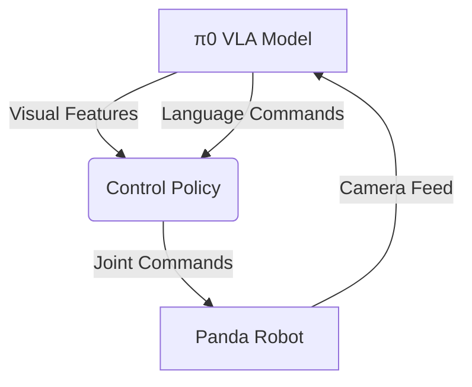

# π0 VLA and Franka Panda Integration Guide

## System Architecture


## Implementation Steps

1. **Environment Setup**:
```python
# Load π0 model
pi0 = PiZeroVLA.load_from_checkpoint("pi0.ckpt")

# Initialize Panda environment
env = gym.make("PandaPickAndPlace-v0")
```

2. **Real-time Control Loop**:
```python
while True:
    # Get observation
    img = env.render(mode='rgb_array')
    obs = env.get_observation()
    
    # Generate action
    action = pi0.predict(img, "Pick up the block")
    panda_action = transform_action(action)
    
    # Execute
    obs, _, done, _ = env.step(panda_action)
```

## Action Space Mapping
| π0 Output | Panda Control | Range |
|-----------|--------------|-------|
| x,y,z     | EE position  | ±0.5m |
| grip      | Gripper width| 0-0.08m|

## Debugging Checklist
1. **Vision Alignment**:
   - Verify camera calibration
   - Check coordinate transformations

2. **Control Issues**:
   - Monitor joint limits
   - Adjust control frequency (50Hz recommended)

3. **Performance Tuning**:
   - Fine-tune π0 on Panda-specific tasks
   - Adjust reward shaping
【34†】【55†】【78†】